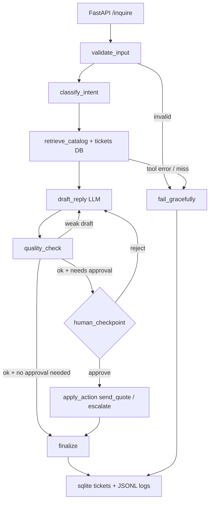

# Week 2 Day 5 — Architecture

## Use case

**Web3Geeks Client Inquiry Desk**

Inbound client messages about catalog gear (price, stock, compare, quote, escalate).
The agent checks the request, looks up the local catalog, drafts a reply, and waits for a human before sending a quote or escalating a ticket.

## Framework choice

**LangGraph** (not CrewAI) for this project.

The flow needs clear steps: validate → classify → retrieve → draft → quality loop → human approval → finalize. LangGraph makes that path and the approval pause easy to follow. CrewAI helped in Day 4 for role handoffs, but a manager crew added time/cost on a similar catalog task without much better answers. A raw ReAct loop (Day 1) is fine for demos, but weaker for saving state and approval gates. Day 2–4 catalog tools and Day 3 HITL ideas are reused here.

## Diagram

## Components

| Piece | What it is |
|-------|------------|
| Agents/nodes | validate, classify, retrieve, draft, quality_check, human_checkpoint, apply_action, finalize, fail_gracefully |
| Tools | `search_catalog`, `get_product`, `calculator`, `log_ticket` (SQLite) |
| Data | `data/products.csv`, `data/tickets.db` |
| State | message, intent, retrieved facts, draft, scores, approval flags, metrics, errors |
| Human checkpoint | before `send_quote` or `escalate` |

## Failure handling (examples)

1. **Bad input** — empty / too short → clear error, skip the model when possible.
2. **Catalog / tool failure** — unknown product or simulated timeout → clear message, ticket logged as `failed`.
3. **Weak / empty draft** — quality loop retries; if still bad, return the error message.
