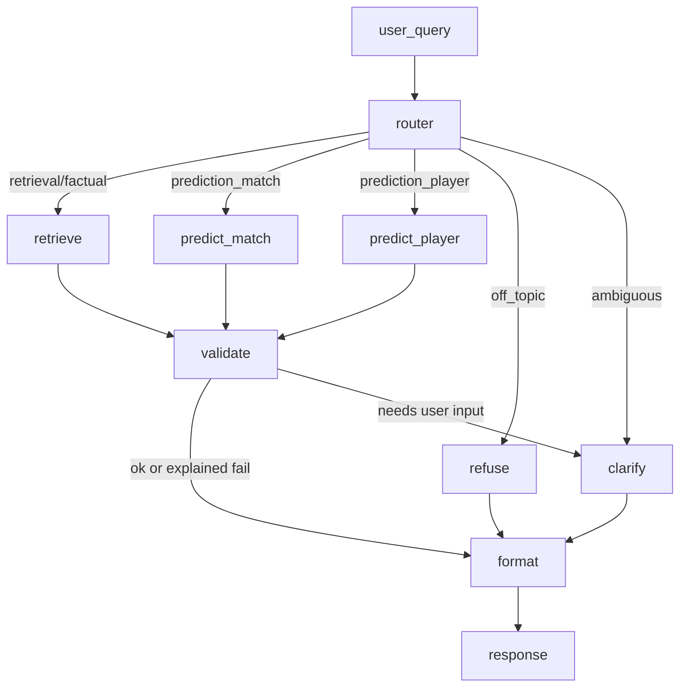

# Week 3 Day 4 — Graph design

## State

| Field | Role |
|-------|------|
| `user_query` | latest user text |
| `history` | prior turns (optional) |
| `intent` | factual / retrieval / prediction_* / off_topic / ambiguous |
| `route` | retrieve / predict_match / predict_player / refuse / clarify |
| `teams` / `player` / `match_date` | resolved entities |
| `tool_name` / `tool_result` / `tool_error` | tool I/O |
| `needs_clarification` | validation failed / missing inputs |
| `final_response` | user-facing text |
| `trace` | node breadcrumbs |

## Graph

## Why explicit LangGraph routing

A single free-form LangChain agent can tip without probabilities, skip tools, or mix chat tone with made-up odds.
Dedicated prediction nodes always attach win probabilities + feature drivers and a “not certain” disclaimer; clarify/refuse paths stop guessing when names or dates are missing.
