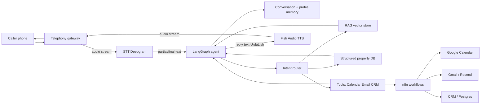
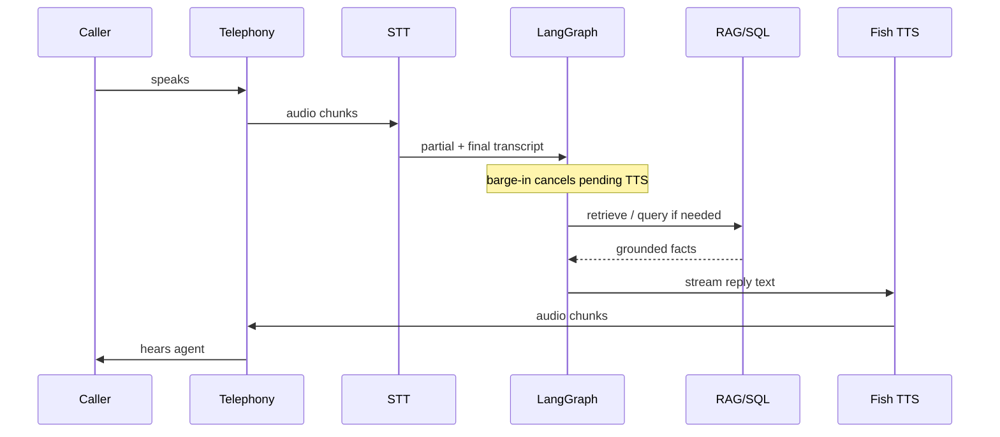

# Task 1 — Modern Voice Agent Architecture

Real estate phone agent = low-latency loop: hear → think → act → speak. A chatbot can wait; a call cannot.

## Pipeline layers

| Layer | Role | Typical tech (this project) |
|-------|------|-----------------------------|
| **Telephony** | Answer / hang up, audio in-out, call metadata | Twilio / Vonage / SIP → WebSocket to backend |
| **Speech-to-Text (STT)** | Stream mic audio → partial + final transcripts | Deepgram Nova-3 (live); Whisper if offline |
| **VAD / turn-taking** | Detect end of user speech; allow barge-in | Deepgram endpointing + local energy VAD |
| **LLM reasoning** | Intent, reply plan, when to call tools | GPT / Claude / Gemini |
| **Tool calling** | Search property, calendar, email, CRM | LangGraph / LangChain tools |
| **Retrieval (RAG)** | Brochure/FAQ facts without inventing | Embeddings + Chroma/FAISS; SQL for prices |
| **Memory** | Budget, area, name across turns | Short-term state in LangGraph; long-term CRM DB |
| **Text-to-Speech (TTS)** | Stream reply audio in UrduLish | **Fish Audio** (primary) |
| **Workflow orchestration** | Retry email/calendar; CRM sync | n8n + LangGraph nodes |

## Architecture diagram

## Call-time sequence (one turn)

## Why each piece matters on a *sales* call

- **STT streaming:** start planning the reply before the user finishes (“budget teen crore…”).
- **Tool calling:** never hardcode inventory; ask SQL/RAG for live availability.
- **Memory:** “us se sasti” only works if budget + last shortlist are in state.
- **TTS streaming:** first audio byte target &lt; ~300–500 ms after text starts; full turn under ~2 s when tools are cache-warm.
- **Telephony barge-in:** if the user interrupts, stop TTS immediately — humans do this constantly.
- **n8n:** calendar/email failures should retry off the hot path so the voice loop stays fast.

## Production constraints (Day 1 design rules)

1. Voice path stays thin: no heavy PDF parsing mid-call.  
2. Structured fields (price, size, available) come from SQL — not free-form LLM memory.  
3. Soft copy (amenities story, FAQ tone) can come from RAG.  
4. Every booking goes through availability check → calendar create → email → CRM log.  
5. Off-topic / injection → polite UrduLish refuse + offer human handoff.

## Out of scope for Day 1

Implementation of STT/TTS APIs, DB schemas, and LangGraph code — covered Day 2–5. This doc is the blueprint those days follow.
