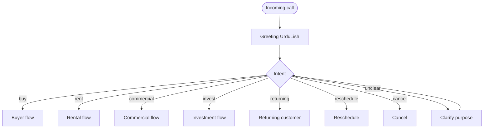
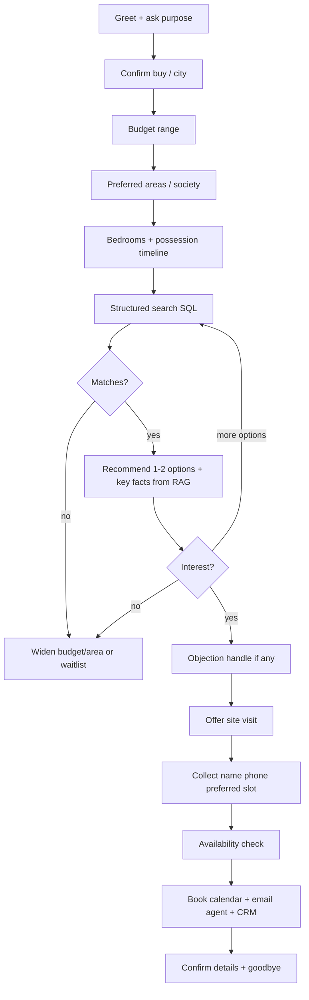
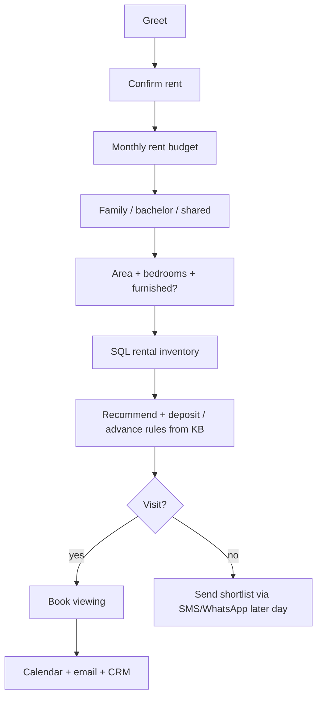
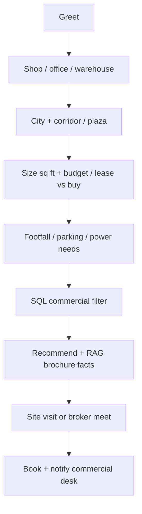
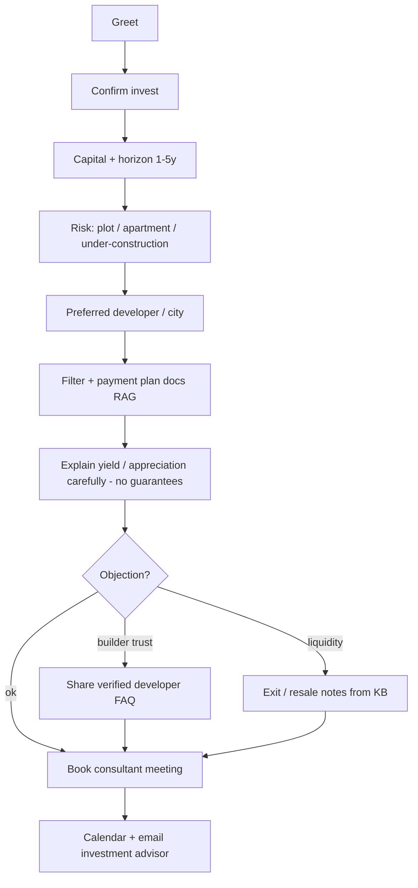
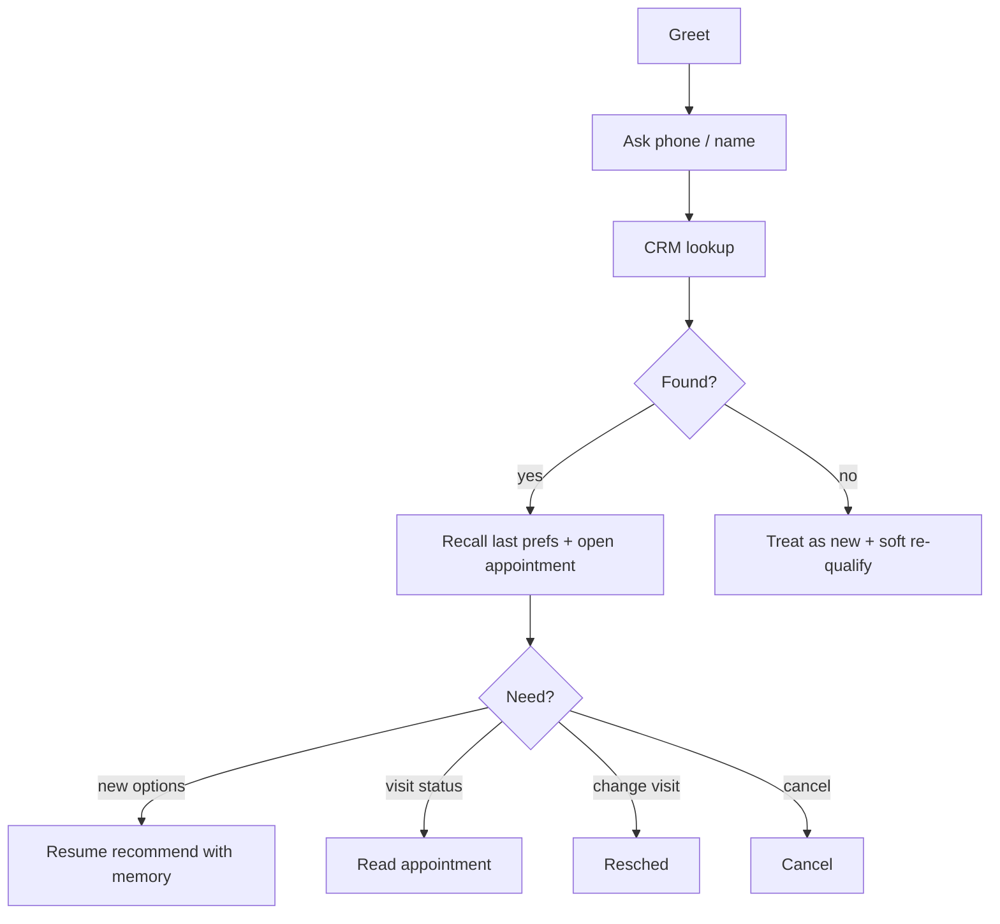
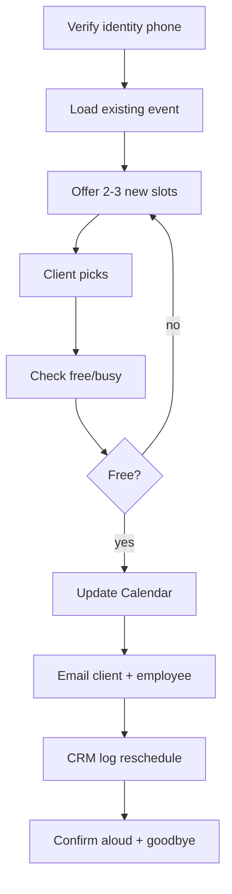
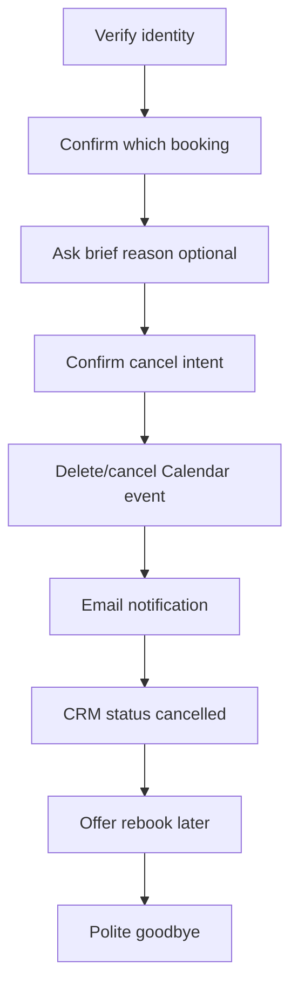

# Task 2 — Conversation Flows

All flows assume: agent = RealEstate Hub UrduLish sales exec; goal = qualify → recommend → book site visit (or help returning client manage appointment).

Shared entry: ring → greeting → intent detect → branch.

---

## 1. Buyer inquiry

**Sample path:** budget → DHA/Bahria → 3 bed → shortlist → “price thoda zyada” → payment plan FAQ → visit Saturday 4pm.

---

## 2. Rental inquiry

---

## 3. Commercial property inquiry

---

## 4. Investment inquiry

**Guardrail:** never promise ROI percentages not in the knowledge base.

---

## 5. Returning customer

---

## 6. Appointment rescheduling

---

## 7. Appointment cancellation

---

## Turn-taking rules (all flows)

| Situation | Agent behavior |
|-----------|----------------|
| User interrupts | Stop TTS; listen; acknowledge (“Ji boliye…”) |
| Silence &gt; 3s | Soft prompt (“Sir, aap sun rahe hain?”) |
| Anger | Empathy → clarify → human escalation offer |
| Unknown fact | “Confirm karke batata hoon” → RAG/SQL → never invent |
| Ready to book | Collect name, phone, slot; read back once |

## Success metrics per flow

- Buyer/rental/commercial/invest: **qualified lead** or **booked visit**  
- Returning: correct recall without re-asking everything  
- Reschedule/cancel: calendar + email + CRM all updated  
