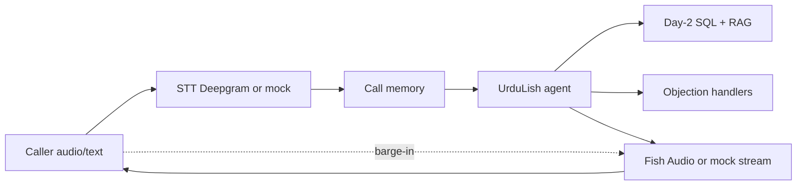

# Voice pipeline (Day 3 Task 1)

## Budget

| Stage | Target |
|-------|--------|
| STT finalize | ≤ 500 ms |
| Reason + tools | ≤ 800 ms |
| TTS time-to-first-audio | ≤ 400 ms |
| **Total** | **≤ 2000 ms** |

Mock mode simulates partial STT, tool thinking fillers, and chunked TTS. Live keys swap providers without changing the agent.
